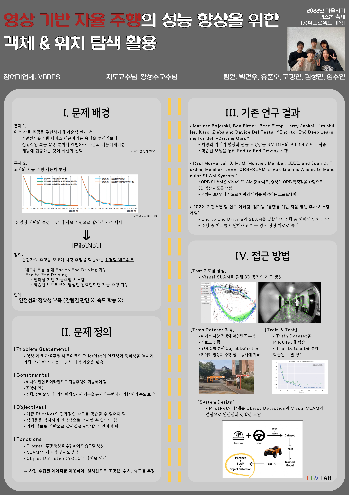

# SLAM-E2E.v2

## 2023 Capstone design_Handong CGV

* Goal :  Stable Autonomous Driving
* Implementation : PilotNet + ORB SLAM3 + YOLO.v4
* Member : 유준호 고강현 박건우 임수현 김성민
* Stack
  * docker
  * TensorRT
  * PilotNet
  * ORBSLAM3
  * YOLO
* Docker
  * docker pull askimo/kyp3
* Dependency
  * TensorR 8.4 +
  * Pangolin
  * cmake 3.16.0 +
  * opencv 4.4.0
  * Pytorch
  * test_from Kh COM
  * test_from geonwoo_2.3
  * test again
 
# Description

